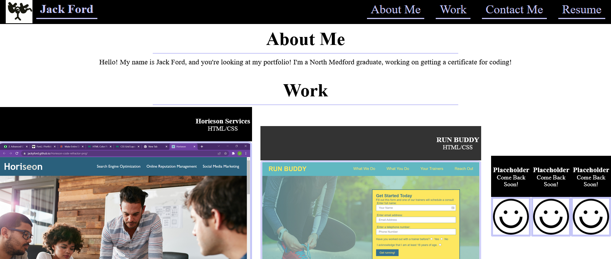

# CSS-Portfolio
For this project, I had to create a professional portfolio using knowledge and application of advanced CSS. I struggled to create a usable format for displaying projects, and got wrapped up in trying to create a CSS grid rather than just using flexbox where necessary. After untangling myself from that whole mess, I was able to create an interactive and aesthetically pleasing portfolio.

